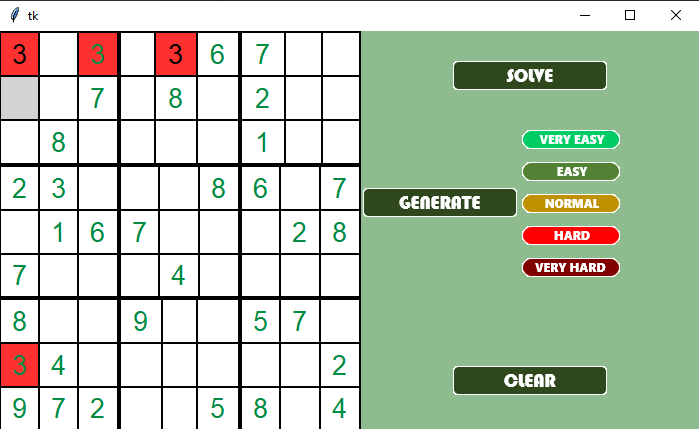
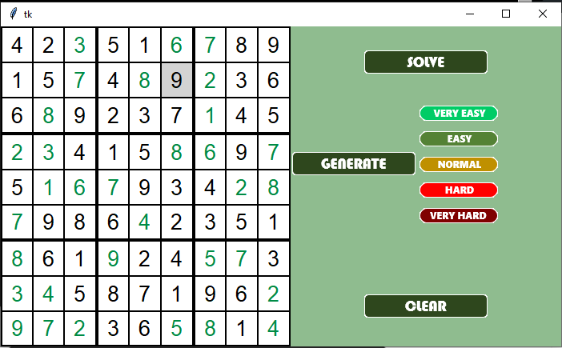
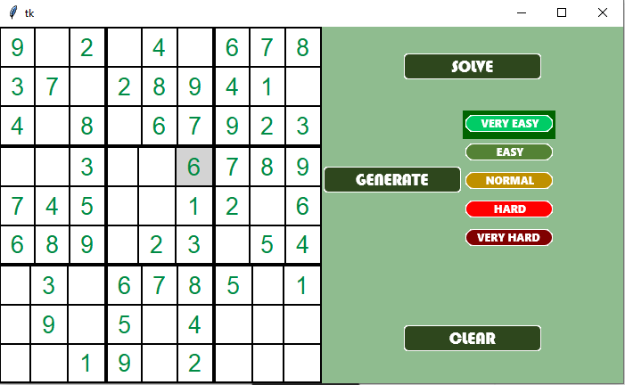
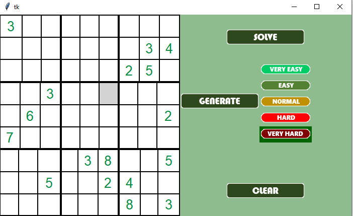

# SudokuIAOrTools
An IA to solve Sudoku with Google OrTools and Tkinter

The sudoku is fully playable with the arrow and the keypad.  
→ : go right  
← : go left  
↑ : go up  
↓ : go down  
\[1-9] : enter number into the grid (except if the number is an initial values)  
0 : delete number of the grid (except if the number is an initial values)  

SOLVE BUTTON : Solve the sudoku if possible, if not print 'Not Feasible' into the console.  
GENERATE : Generate a random sudoku with the choosen difficulty (VERY EASY to VERY HARD)  
CLEAR : Clear the grid from the non initial values

# Errors display :
 

# Solving :
 

# Generation :
Very Easy :   
 

Very Hard :  
 

